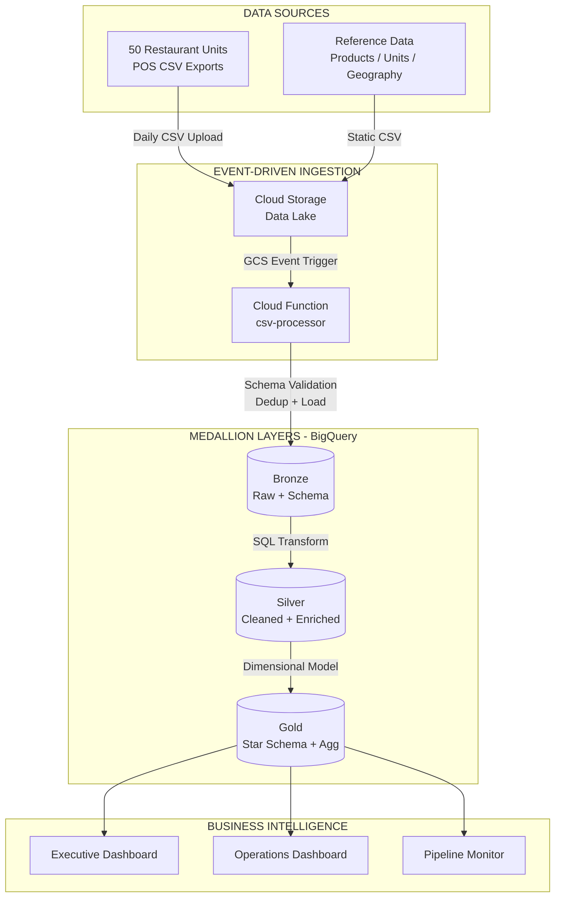

<div align="center">

> **Documentação completa disponível em HTML:**
> Baixe o arquivo [`docs/MR_HEALTH_Data_Platform_Portfolio.html`](docs/MR_HEALTH_Data_Platform_Portfolio.html) e abra no navegador para visualizar o portfólio interativo com diagramas, métricas e detalhes da arquitetura.

# MR. HEALTH Data Platform

### Enterprise-Grade Data Warehouse on GCP | Zero Infrastructure Cost

[](https://github.com)
[](https://cloud.google.com/free)
[](https://cloud.google.com/free)
[](https://python.org)
[](https://cloud.google.com/bigquery)
[](https://github.com)
[](LICENSE)

**Event-Driven Ingestion | Medallion Architecture | Star Schema | Looker Studio Dashboards**

[Getting Started](#getting-started) &middot; [Architecture](#architecture) &middot; [Portfolio](docs/MR_HEALTH_Data_Platform_Portfolio.html) &middot; [Strategic Plan](docs/STRATEGIC_PLAN.md)

</div>

---

## Overview

**MR. HEALTH Data Platform** is a zero-cost data warehouse built on GCP Free Tier. It processes daily sales CSVs from a 50-unit restaurant chain through an automated event-driven pipeline (GCS → Cloud Function → BigQuery Bronze/Silver/Gold → Looker Studio).

| Metric | Value |
|--------|-------|
| **Monthly Cost** | $0.00 (100% GCP Free Tier) |
| **Data Latency** | < 3 minutes end-to-end |
| **Test Coverage** | 97.2% (22 unit tests) |
| **Scalability** | 10x headroom within free tier |
| **Development Time** | ~8h (AI-assisted) vs. ~160-230h manual — [details](docs/MR_HEALTH_Data_Platform_Portfolio.html) |
| **Strategic Score** | 90/100 — [breakdown](docs/STRATEGIC_PLAN.md) |

**Problem:** 50 units send 100 CSVs/day, consolidated manually in Excel (4-6h/day, 2-5% error rate, D+1 to D+3 latency).
**Solution:** Automated event-driven pipeline — consolidation in < 3 minutes, ~0% errors, near real-time. Full comparison in [Portfolio](docs/MR_HEALTH_Data_Platform_Portfolio.html).

---

## Architecture



| Decision | Choice | Rationale |
|----------|--------|-----------|
| **Ingestion** | Cloud Functions (2nd gen) | Event-driven, serverless, $0 vs $50/mo for Dataproc |
| **Warehouse** | BigQuery | Serverless analytics, 1 TB/mo free queries |
| **Transformation** | BigQuery SQL (13 scripts) | Familiar syntax, no external tools needed |
| **Orchestration** | GCS Event Triggers | Zero-polling, automatic on file upload |
| **Visualization** | Looker Studio | Native GCP integration, unlimited free usage |
| **Modeling** | Kimball Star Schema | 4 dimensions + 2 facts + 3 aggregations |

---

## Data Model

```
CSV Files (POS) ──> Bronze (Raw + Schema) ──> Silver (Clean + Enriched) ──> Gold (Star Schema)
```

| Layer | Tables | Purpose |
|-------|--------|---------|
| **Bronze** | `orders`, `order_items`, `products`, `units`, `states`, `countries` | Schema-enforced raw data with ingestion metadata |
| **Silver** | `orders`, `order_items`, `products`, `units`, `states`, `countries` | Cleaned, deduplicated, type-normalized, date-enriched |
| **Gold** | 4 dimensions + 2 facts + 3 aggregations | Star schema for analytics and dashboards |

```
                 dim_date
                    |
    dim_product --- fact_sales --- dim_unit
                    |                |
                    |           dim_geography
              fact_order_items
```

---

## Repository Structure

```
mrhealth-data-platform/
├── cloud_functions/csv_processor/   # Event-driven CSV processor (GCS → BigQuery Bronze)
├── config/project_config.yaml       # Centralized configuration
├── docs/                            # Technical documentation + portfolio
├── scripts/                         # Infrastructure & pipeline automation [1-8]
│   ├── generate_fake_sales.py       # [1] Test data generator
│   ├── deploy_phase1_infrastructure.py # [2] BigQuery datasets + tables
│   ├── upload_fake_data_to_gcs.py   # [3] Upload CSVs to GCS
│   ├── load_reference_data.py       # [4] Load reference data to Bronze
│   ├── build_silver_layer.py        # [5] Silver SQL transformations
│   ├── build_gold_layer.py          # [6] Gold star schema
│   ├── build_aggregations.py        # [7] KPI aggregation tables
│   └── verify_infrastructure.py     # [8] Validate infrastructure + data
├── sql/                             # 13 ELT scripts (bronze/ silver/ gold/)
├── tests/unit/                      # 22 pytest cases | 97.2% coverage
├── requirements.txt
└── README.md
```

---

## Getting Started

> **Full step-by-step guide:** [docs/SETUP_GUIDE.md](docs/SETUP_GUIDE.md)

### Prerequisites

- GCP account with billing enabled (stays within free tier)
- [Google Cloud SDK](https://cloud.google.com/sdk/docs/install) (`gcloud`, `gsutil`, `bq`)
- Python 3.11+

### Quick Setup

```bash
# 1. Clone and configure
git clone <repository-url>
cd mrhealth-data-platform
pip install -r requirements.txt

# 2. Authenticate with GCP
gcloud auth login
gcloud auth application-default login
gcloud config set project YOUR_PROJECT_ID

# 3. Enable required APIs
gcloud services enable storage.googleapis.com bigquery.googleapis.com \
  cloudfunctions.googleapis.com eventarc.googleapis.com run.googleapis.com

# 4. Create infrastructure
python scripts/deploy_phase1_infrastructure.py

# 5. Generate and upload test data
python scripts/generate_fake_sales.py
python scripts/upload_fake_data_to_gcs.py
python scripts/load_reference_data.py

# 6. Deploy Cloud Function
cd cloud_functions/csv_processor
gcloud functions deploy csv-processor \
  --gen2 --runtime=python311 --region=us-central1 --source=. \
  --entry-point=process_csv \
  --trigger-event-filters="type=google.cloud.storage.object.v1.finalized" \
  --trigger-event-filters="bucket=YOUR_BUCKET_NAME" \
  --memory=256MB --timeout=300s \
  --set-env-vars="PROJECT_ID=YOUR_PROJECT_ID,BUCKET_NAME=YOUR_BUCKET_NAME,BQ_DATASET=case_ficticio_bronze"
cd ../..

# 7. Build transformation layers
python scripts/build_silver_layer.py
python scripts/build_gold_layer.py
python scripts/build_aggregations.py

# 8. Verify everything
python scripts/verify_infrastructure.py
```

Then create dashboards following [docs/LOOKER_STUDIO_SETUP.md](docs/LOOKER_STUDIO_SETUP.md).

---

## Testing

```bash
pytest tests/unit/ -v --cov=scripts --cov-report=term-missing
```

**Results:** 22 unit tests | 97.2% coverage | Validates schema integrity, business rules, referential consistency, and statistical distributions.

---

## Cost Analysis

| Service | Free Tier Limit | Actual Usage | Utilization |
|---------|----------------|--------------|-------------|
| Cloud Storage | 5 GB | ~1 MB | 0.02% |
| BigQuery Storage | 10 GB | ~2 MB | 0.02% |
| BigQuery Queries | 1 TB/month | ~10 GB | 1% |
| Cloud Functions | 2M invocations/month | ~3K | 0.15% |
| Looker Studio | Unlimited | 3 dashboards | N/A |

**Monthly cost: $0.00** — All services use GCP's permanent Free Tier (not a trial). Production upgrade path: ~$50-75/month with Dataproc + Datastream CDC. No architecture refactoring required.

---

## Scope

This is a **functional MVP** with running code. Production-only features (PostgreSQL CDC via Datastream, automated Slack/email alerts, Dataform orchestration, CI/CD pipeline) are fully designed in [STRATEGIC_PLAN.md](docs/STRATEGIC_PLAN.md). See [Portfolio](docs/MR_HEALTH_Data_Platform_Portfolio.html) for the complete MVP vs. Production comparison.

---

## Documentation

| Document | Description |
|----------|-------------|
| [**Setup Guide**](docs/SETUP_GUIDE.md) | Step-by-step replication guide with all GCP commands |
| [**Architecture**](docs/ARCHITECTURE.md) | Technical deep-dive: layers, data models, security, DR |
| [**Dashboard Guide**](docs/LOOKER_STUDIO_SETUP.md) | Looker Studio dashboard creation walkthrough |
| [**Strategic Plan**](docs/STRATEGIC_PLAN.md) | Strategic assessment, product backlog, risk analysis (90/100) |
| [**Portfolio**](docs/MR_HEALTH_Data_Platform_Portfolio.html) | Interactive project showcase with diagrams and details |

---

## Author

**Arthur Maia Graf**

[Portfolio](docs/MR_HEALTH_Data_Platform_Portfolio.html) &middot; [GitHub](https://github.com) &middot; [LinkedIn](https://linkedin.com)

---

<div align="center">

**Built with GCP Free Tier &middot; BigQuery &middot; Cloud Functions &middot; Looker Studio**

</div>
